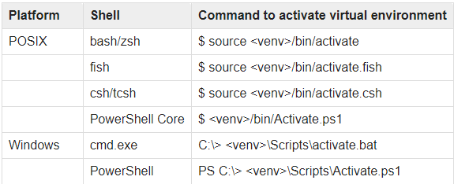

### activate your environments
```bash
  python -m venv .
```

### enter in your venv environments



### install all dependencies
```bash
  pip install -r requirements.txt
```

### run server
```bash
  python ./Include/producer/server.py
```

### run client
```bash
  python ./Include/consumer/client.py
```

<br>
<p align="center">
   Feito com ❤️ by <b>weliton sousa</b>
</p>
